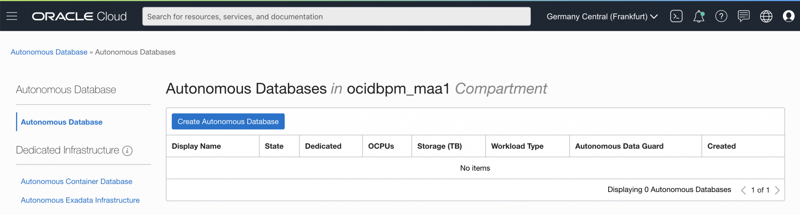
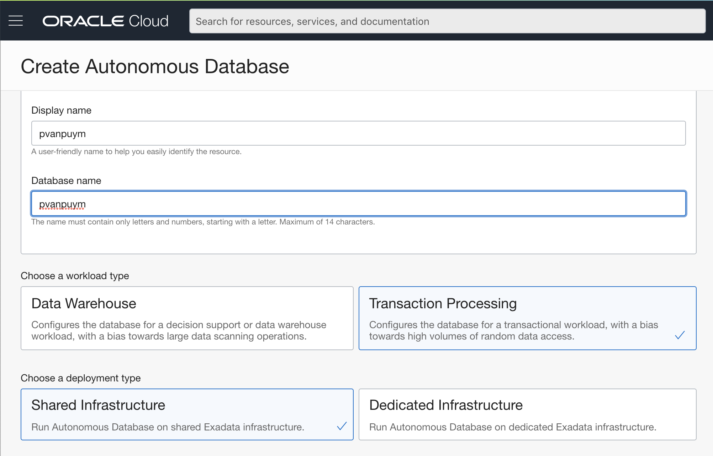
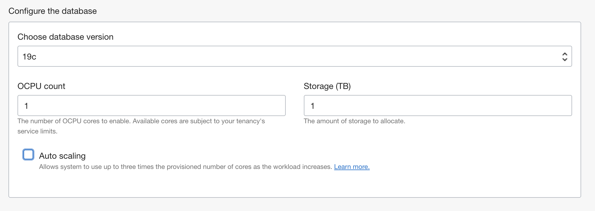
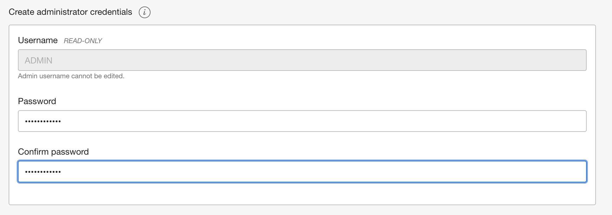
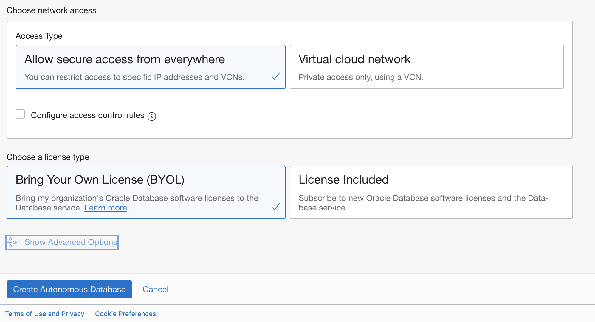
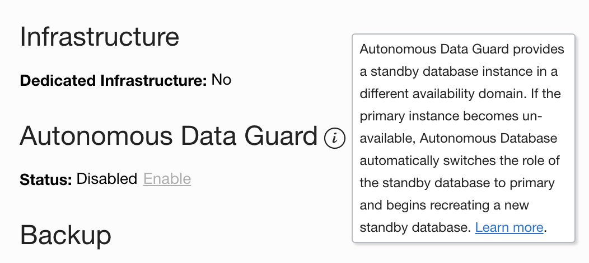
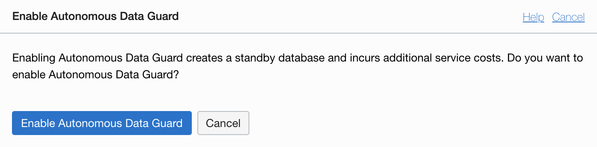
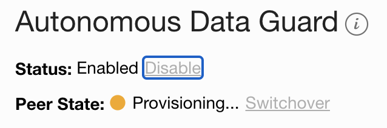
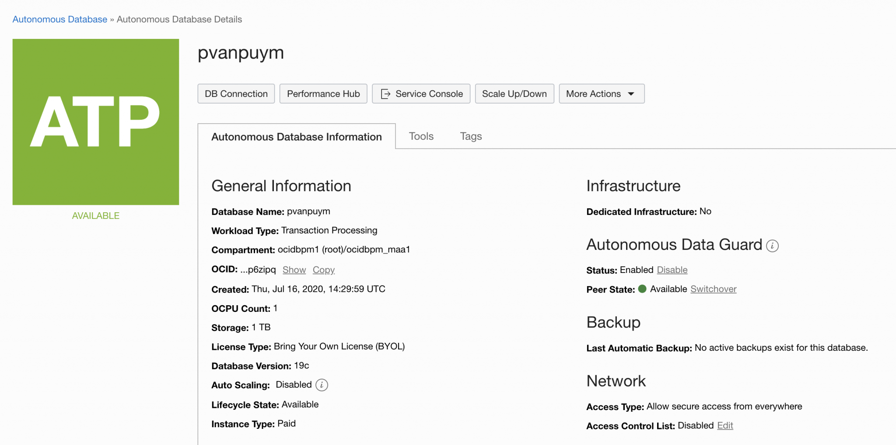

# Setup Autonomous Data Guard 19c 

In this lab we will setup 19c Data Guard between a primary server and a secondary server. 

This Lab assumes that there are 2 identical servers available. For example the 19c Database Market place image from the OCI. 

> **Warning** on copying and pasting commands with multiple lines from the browser screen; when you copy from outside of the Remote Desktop environment and paste inside the Remote Desktop environment, additional **enters** or CRLF characters are pasted causing some commands to fail. Solution: Open this lab inside the browser inside the Remote Desktop session.

## Disclaimer ##
The following is intended to outline our general product direction. It is intended for information purposes only, and may not be incorporated into any contract. It is not a commitment to deliver any material, code, or functionality, and should not be relied upon in making purchasing decisions. The development, release, and timing of any features or functionality described for Oracle’s products remains at the sole discretion of Oracle.

## Setup the ADB-S Database

Create your ADB-S Database. You can do this by clicking the “Create autonomous Database” button.

Fill in some basic information

Make sure you select a 19c database

And of course you will need a good password.

For Demo purposes (I will destroy it afterwards anyhow) I took network settings to be available from everywhere, but if you want to deploy it for production use, please use your own VCN and make sure it is not publicly available on the world wide web.

When the creation has finished, we need to enable the Autonomous Data Guard. By default it is disabled.

## Enable Autonomous Data Guard ##

It is as easy as clicking the button

You agree that the magic will incur some service costs. Which of course is normal as we are using more resources.
During the creation of the peer database it tells you it is busy doing so

So you see here that no hard work is to be done. Just click the link and the system does everything for you. Whilst it is doing so, it is a good moment to have a look at the documentation here: h[ttps://docs.cloud.oracle.com/en-us/iaas/adbdataguard/autonomous-data-guard-enable.html](https://docs.cloud.oracle.com/en-us/iaas/adbdataguard/autonomous-data-guard-enable.html) 

And after a while we have setup our Autonomous Data Guard in a serverless ADB instance!

