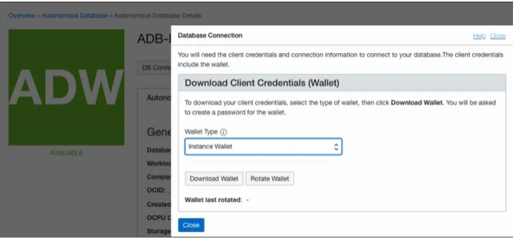

# Autonomous Data Guard 19c Role transitions using the GUI

In this lab we perform a role transition on the Autonomous Data Guard. 


> **Warning** on copying and pasting commands with multiple lines from the browser screen; when you copy from outside of the Remote Desktop environment and paste inside the Remote Desktop environment, additional **enters** or CRLF characters are pasted causing some commands to fail. Solution: Open this lab inside the browser inside the Remote Desktop session.

## Prepare the test environment

The first step is to make sure that Autonomous Data Guard is enabled on your ADB-S database. You see this in the browser


So it is enabled and available.

In order to connect to an autonomous database, you need a wallet zipfile.

To download the wallet, browse to the database you see a button “DB Connection” and that brings up following window



Click **Download Wallet** and store it locally.

In order to use it we need to understand how it works. So lets see what is inside by unzipping it.

````
$ unzip Wallet_ADBDemo.zip
Archive:  Wallet_ADBDemo.zip
  inflating: README
  inflating: cwallet.sso
  inflating: tnsnames.ora
  inflating: truststore.jks
  inflating: ojdbc.properties
  inflating: sqlnet.ora
  inflating: ewallet.p12
  inflating: keystore.jks
$
````

When you look at the `tnsnames.ora` it will have only 3 entries, a high, low and medium one.

## Prepare Swingbench

To demonstrate how it works, we will use Swingbench. This benchmark tool can be dowloaded from [here](https://github.com/domgiles/swingbench-public/releases/download/production/swingbenchlatest.zip).

You can create xml files to start with and I have copied SOE_Server_Side_V2.xml to ADBDemo_audg.xml.

Modify the connection part to connect to the ADB-S instance.

````
  <Connection>
        <UserName>soe</UserName>
        <Password></Password>
        <ConnectString>xxx_service_name_xxx</ConnectString>
        <DriverType>Oracle jdbc Driver</DriverType>
        <ConnectionPooling>
            <PooledInitialLimit>50</PooledInitialLimit>
            <PooledMinLimit>20</PooledMinLimit>
            <PooledMaxLimit>1000</PooledMaxLimit>
            <PooledInactivityTimeOut>900</PooledInactivityTimeOut>
            <PooledConnectionWaitTimeout>900</PooledConnectionWaitTimeout>
            <PooledPropertyCheckInterval>60</PooledPropertyCheckInterval>
            <PooledAbandonedConnectionTimeout>3600</PooledAbandonedConnectionTimeout>
        </ConnectionPooling>
        <Properties>
            <Property Key="AppContinuityDriver">true</Property>
            <Property Key="FetchSize">20</Property>
            <Property Key="FastFailover">false</Property>
            <Property Key="OnsConfiguration">nodes=xxx_hostname_xxx:6200</Property>
            <Property Key="StatementCaching">50</Property>
            <Property Key="FetchSize">20</Property>
        </Properties>
    </Connection>
````

Change xxx_service_name_xxx with the tnsnames.ora entry you found earlier, and xxx_hostname_xxx with the hostname you have found in the same connect string. Keep the port 6200.

## Run Swingbench

Start swingbench as follows

````
$ ./swingbench -c ../configs/ADBDemo_audg.xml -cf /here/goes/the/path/to/Wallet_ADBDemo.zip
Application :	 Swingbench
Author      :	 Dominic Giles
Version     :	 2.6.0.1137
...
````
and Swingbench pops up


## Perform the role transistion

First step is to navigate to the ADB on which you want to perform the role transition.

Then click the Hyperlink **Switchover** and watch how the role transition takes place and the sessions get started again on the peer Database


## Summary

You have succesfully performed a role transition of the Autonomous Shared database.


