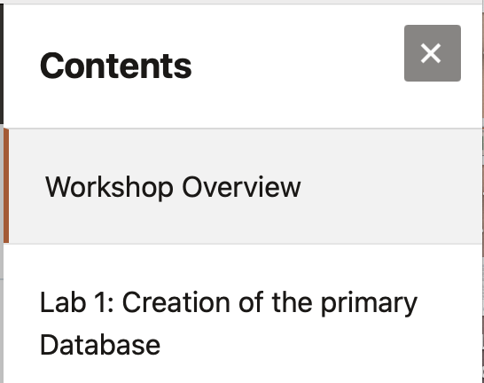

# Active Data Guard 19c Hands-On-Lab (HOL) #

## Workshop Overview ##

**19c Database** is the current version that Oracle promotes to customers and partners as the version to upgrade to. Oracle 19c is the long term support version and will be supported for at least 4 years after the initial release. After this, Extended support and Sustaining support will be available.

This hands-on workshop focuses on **Creating Active Data Guard 19c in Oracle Cloud Infrastructure using DBCS**.

## Workshop Requirements

- Access to 
	- Oracle Cloud Infrastructure 
    	- Provided by the instructor for instructor-led workshops
    	- A HOL version is being created to run stand-alone without instructor
- Access to a laptop or a desktop 

## Disclaimer ##
The following is intended to outline our general product direction. It is intended for information purposes only, and may not be incorporated into any contract. It is not a commitment to deliver any material, code, or functionality, and should not be relied upon in making purchasing decisions. The development, release, and timing of any features or functionality described for Oracle’s products remains at the sole discretion of Oracle.

## Access the labs

- Use **Lab Contents** menu on your right to access the labs.
    - If the menu is not displayed, click the menu button  on the top right  make it visible.

- From the menu, click on the lab that you like to proceed with. For example, if you like to proceed to **Lab 1**, click **Lab 1: Creation of the primary Database**. This lab needs to be completed before the other labs can be run correctly.

- You may close the menu by clicking 

## Acknowledgements ##

- **Author** - Pieter Van Puymbroeck, Product Manager Data Guard, Active Data Guard and Flashback Technologies
- **Special thanks to** - Robert Pastijn, Database Product Management, PTS EMEA