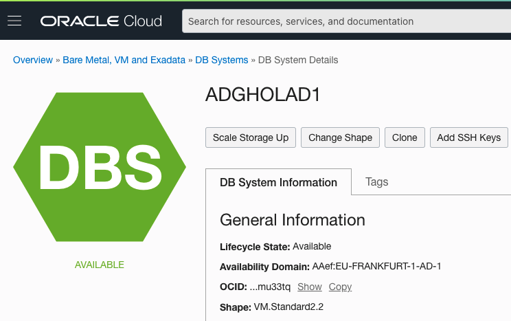
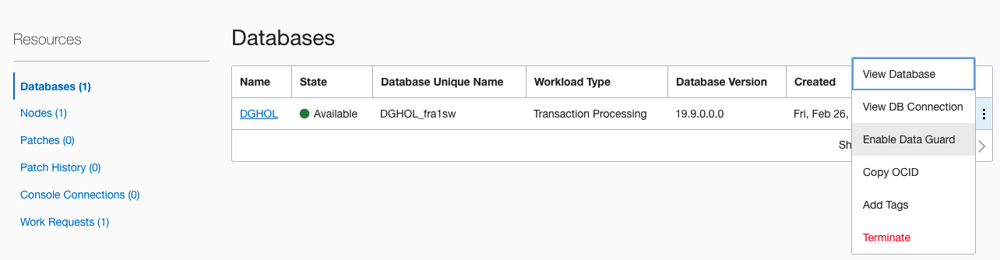
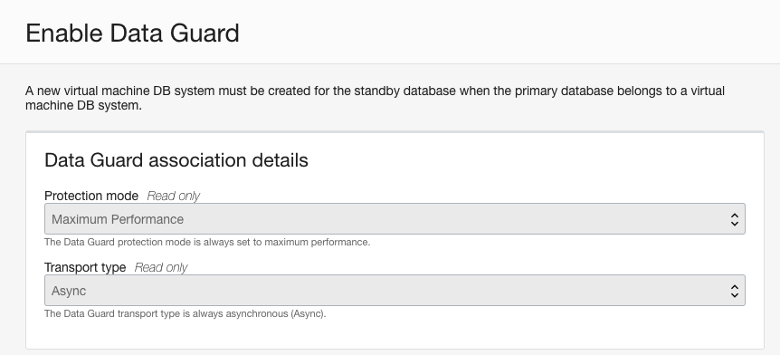
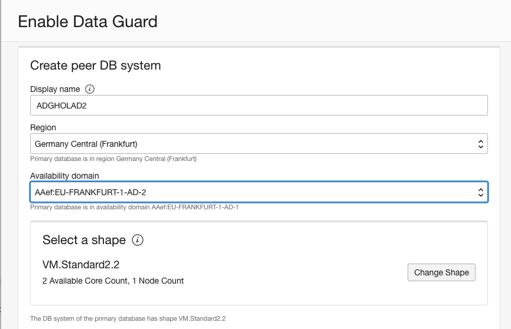
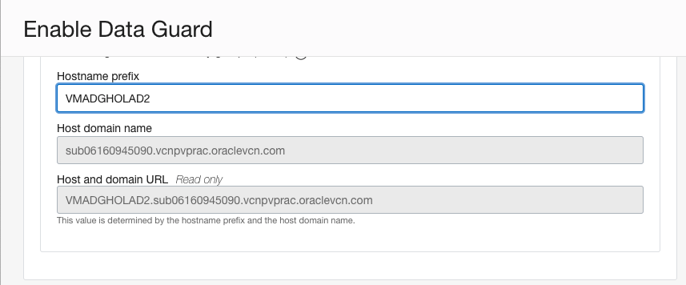
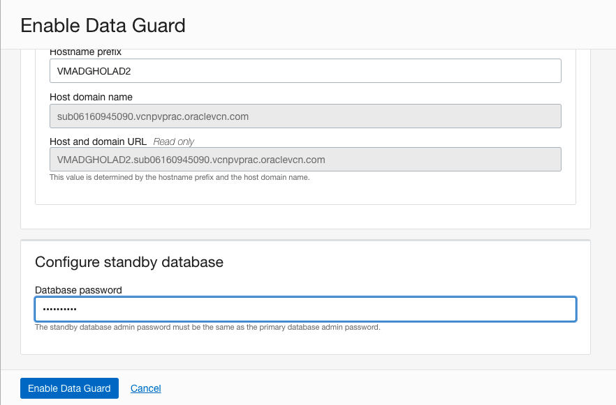
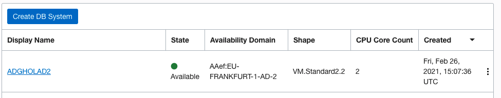
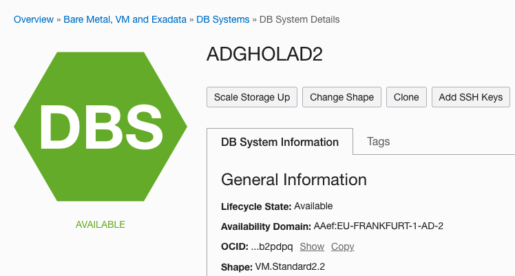
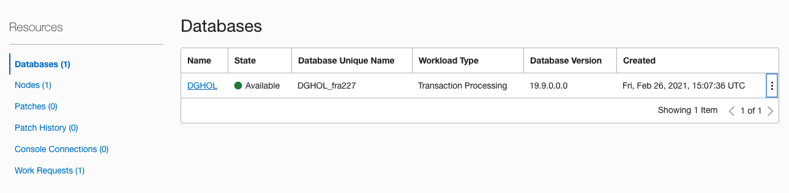
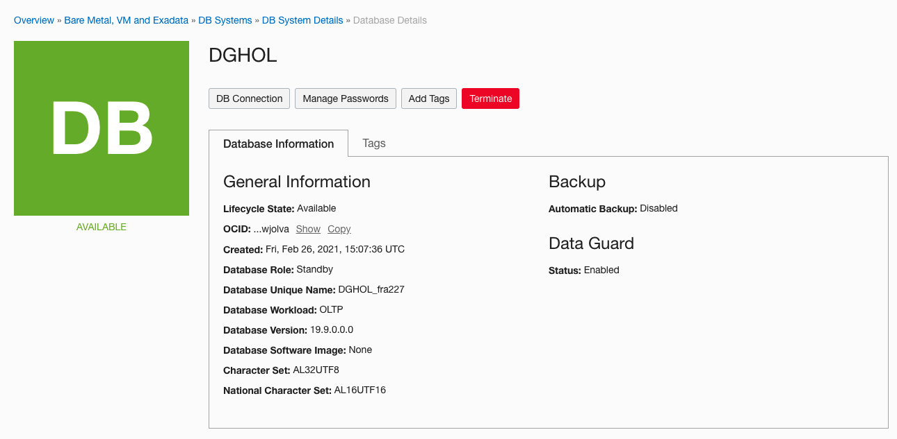

# Creation of the primary Database

In this lab we will setup will create the standby database.

> **Warning** on copying and pasting commands with multiple lines from the browser screen; when you copy from outside of the Remote Desktop environment and paste inside the Remote Desktop environment, additional **enters** or CRLF characters are pasted causing some commands to fail. 

## Create the Standby database

To create the primary database we need to follow a wizard. 

Lab 1 ended with this screen:

Scroll down to the part with the Databases in the DB System and click the Hamburger Menu and select **Enable Data Guard**

This will bring you to the wizard that will create the Standby database. The first part, you cannot modify this. The Standby database will be created with the Maximum Performance protection mode, meaning that it will use Asynchronous redo transport. 

This is not an issue. Even not when SYNC is required, this can be altered manually if needed.

Next step is to define the Peer DB System.
Use following data to create the Peer DB System.
* Display Name: ADGHOLAD2
* Region: use the same region as you have created the primary database. When all goes right, it populates correctly automatically.
* Availability Domain: Choose the second availability domain. In the Frankfurt Example this is AD2.
* Do not change the shape. By default the tooling selects the same shape as the primary shape. This helps to ensure performance when a role transition is performed.

Provide a hostname prefix: **VMADGHOLAD2**

Then all what is left to do is enter the Primary Database password.
Remember that it was set to **WelC0me2##**

Then click "Enable Data Guard" and that are all the steps needed to setup Data Guard in a Database As a Service.

First the Peer DB System will be created and then Data Guard will be instantiated.

Click on the Display name and that brings you to the DB System.

Then scroll down to the Databases section of the page

Then Click on the Database Name, in this example DGHOL.
That will bring you to the Database details where you can find that the Standby Database has been succesfully create and that the Data Guard status is **Enabled**

When this step has been completed, then you have succesfully setup a basic Data Guard configuration in the Oracle Cloud Infrastructure in Maximum Performance mode.

