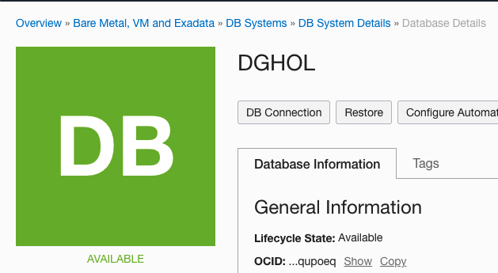

# Connection to the Databases

In this lab we will setup will create the standby database.

> **Warning** on copying and pasting commands with multiple lines from the browser screen; when you copy from outside of the Remote Desktop environment and paste inside the Remote Desktop environment, additional **enters** or CRLF characters are pasted causing some commands to fail. 

## Connection to the Databases

We will use SQL Developer to connect to our new Database System with a primary and a standby database. 
You can run this tool from any desktop that has network connectivity to the Database System.

You can download SQL Developer from this link: [SQL Developer Home page](https://www.oracle.com/be/database/technologies/appdev/sqldeveloper-landing.html) 

When you first opened SQL Developer, the screen looks like this:

## Create the Connection to the primary ##

## Create the Connection to the Standby ##

