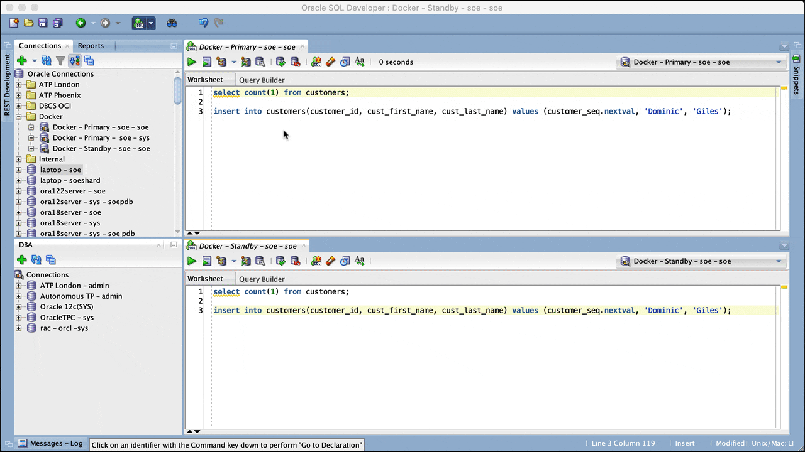
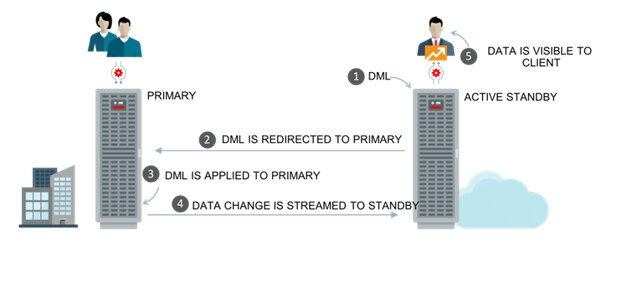
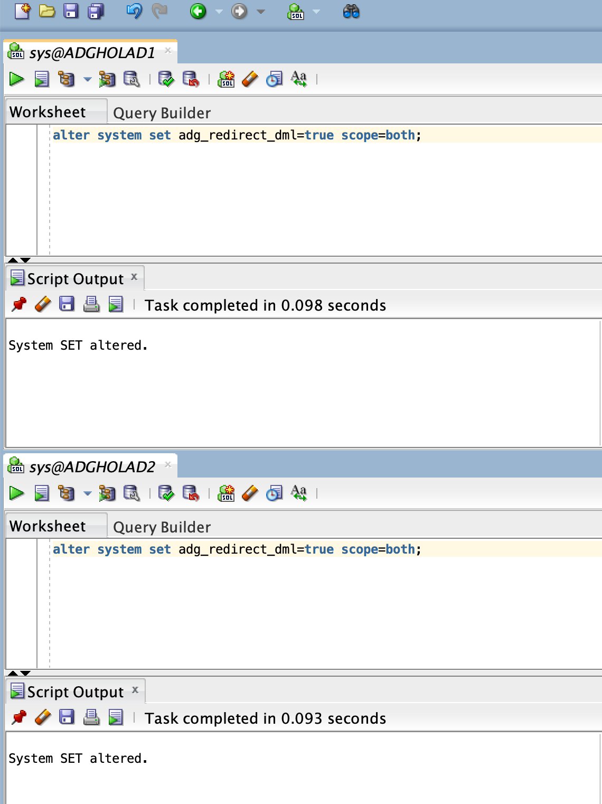
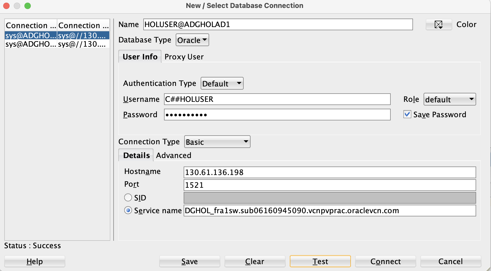
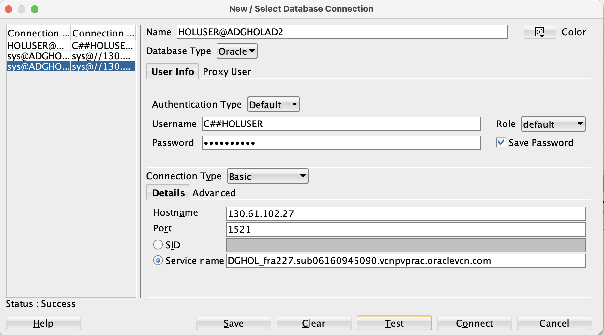
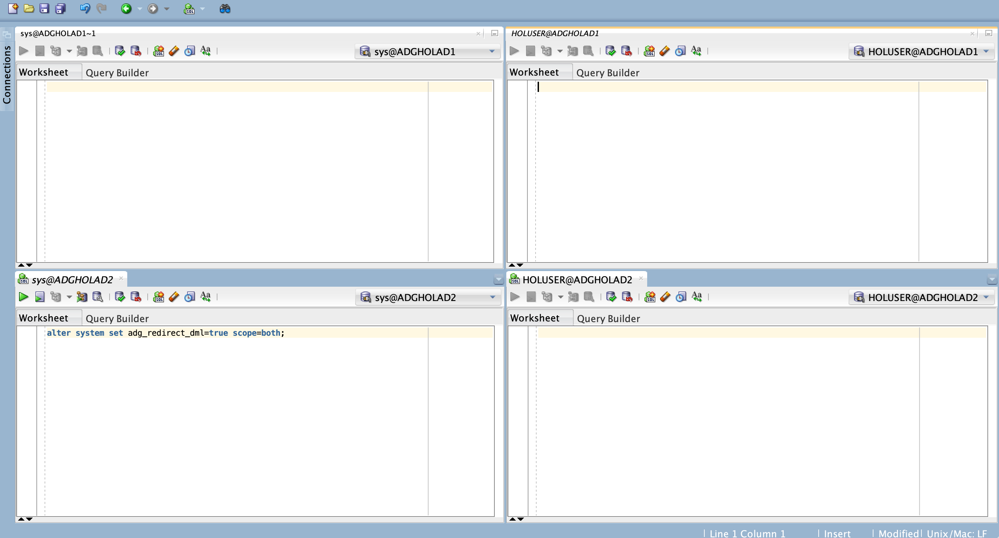
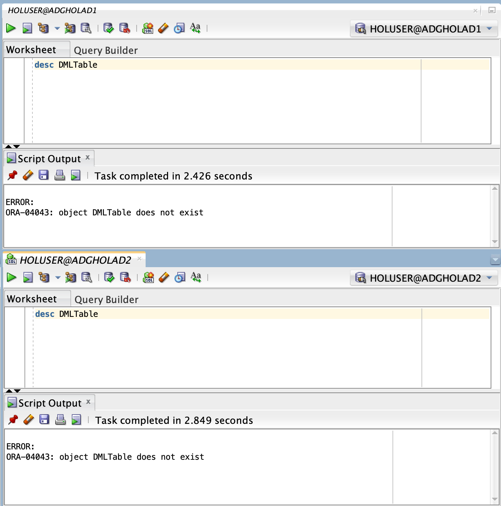
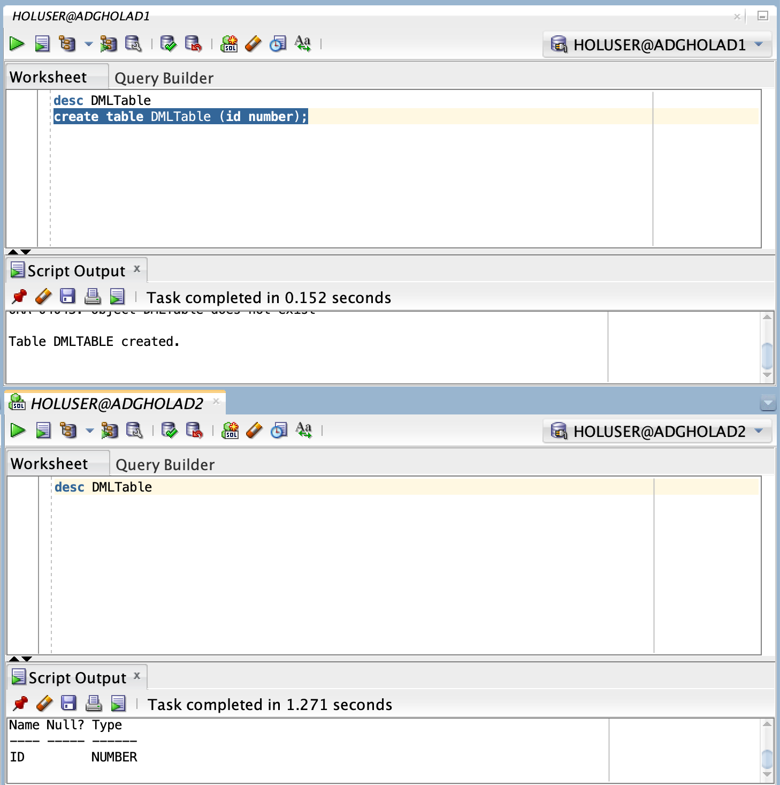
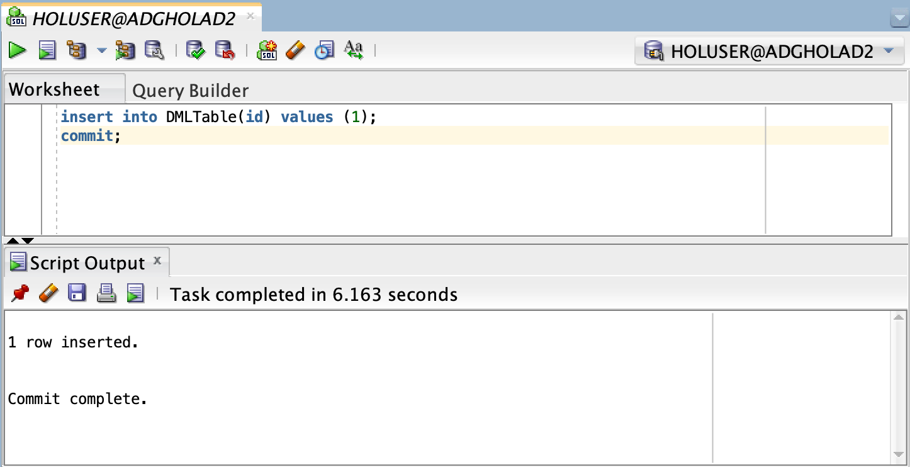
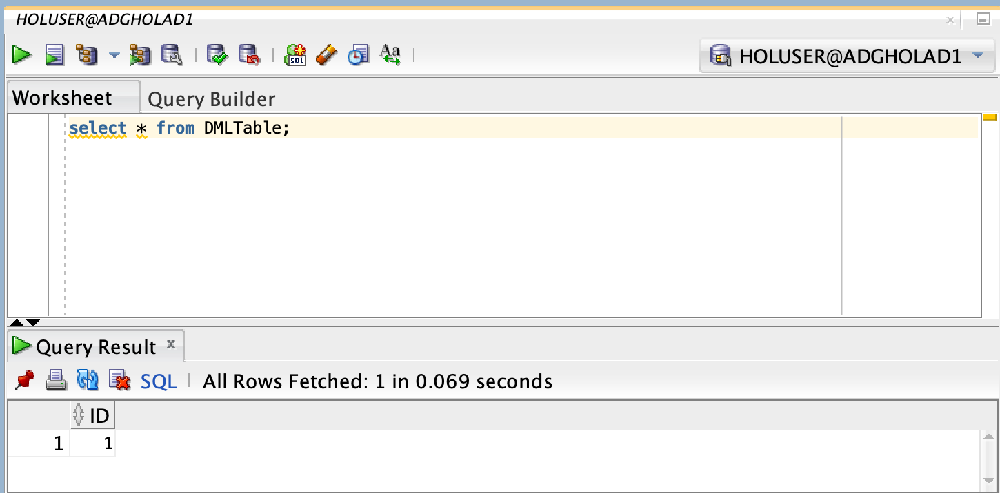

# Enable Active Data Guard DML Redirection

In this lab we will enable the 19c New Feature Active Data Guard DML Redirection.




> **Warning** on copying and pasting commands with multiple lines from the browser screen; when you copy from outside of the Remote Desktop environment and paste inside the Remote Desktop environment, additional **enters** or CRLF characters are pasted causing some commands to fail. 


## Enable Active Data Guard DML Redirection

Oracle Active Data Guard 19c DML Redirection is a new feature which allows you to perform occasional DML Against a read only standby database. 



The DML Redirection process breaks down in 5 steps:

1. The Client issues a DML against the read-only Standby Database
2. The standby notices it is DML and sends this DML towards the primary database using an internal Db-link
3. The primary executes the DML (which then generates redo)
4. This redo is a normal redo stream and together with the normal redo stream this is sent to the standby database
5. The standby database applies the received redo stream and releases the lock on the session so the session can see the result.

We will use SQL Developer to connect to the Database System.You can run this tool from any desktop that has network connectivity to the Database System.

You can download SQL Developer from this link: [SQL Developer Home page](https://www.oracle.com/be/database/technologies/appdev/sqldeveloper-landing.html) 

Please make sure to complete Lab 3 before starting this Lab.


## Create a common user

DML redirection for user tables, cannot be done using the SYS user. 
When you try to run a DML statement, it will fail with:  

**ORA-16397**: *statement redirection from Oracle Active Data Guard standby database to primary database failed*

So we will create a common user in the Database to learn about this feature. 

Using SQL Developer, open the connection to the primary database, which should now be running in AD1.

This can be checked by following query:

````
Select name, db_unique_name, database_role from v$database;
````


Then use following query to create a common user in all the pdbs. 

````
create user C##HOLUSER identified by "WelC0me2##" container = all;
````

Grant this user the minimum privileges required to perform its duties. In a production environment, evaluate carefully the rights common users need. This is just for demonstration purposes that we give this user all the rights possible. For this lab and ease of things, we grant powerful role to the user.

````
grant connect,resource, dba to C##HOLUSER;
````

and verify with this query if the user has been created correctly:

````
select username from dba_users where username like '%HOL%';
````


## Enable the system for ADG DML Redirect

Automatic redirection of DML operations to the primary can be configured at the system level or the session level. The session level setting overrides the system level setting.

* To enable automatic redirection of DML operations to the primary at the system level, set `ADG_REDIRECT_DML` to true.
* To disable automatic redirection of DML operations to the primary at the system level, set `ADG_REDIRECT_DML` to false.

In this Lab we will configure the DML Redirection on database level.
This parameter needs to be set on both the primary and standby database.

More information about this parameter can be found in the [Oracle Documentation.](https://docs.oracle.com/en/database/oracle/oracle-database/19/refrn/ADG_REDIRECT_DML.html#GUID-AC98F026-33BE-41FE-8F2F-EFA296723AD8)

You can use following alter system command to enable this parameter.

````
alter system set adg_redirect_dml=true scope=both;
````


At this point, the databases are enabled for Active Data Guard DML redirection.


## Create a table

To create a table in the common users's schema, it is necessary to create a connection as the common user. This can be done the same way as described in Lab 3. Instead of specifying the username SYS and role SYSDBA, you now specify C##HOLUSER and leave the role default. 



Do the same for the connection to the standby database.



Then log on to both sessions. One on standby, one on primary. 
You could layout SQL Developer like this



In the pane with the C##HOLUSER connection, first check if a DML table exists.

````
desc DMLTable
````

Also verify this on the standby

````
desc DMLTable
````

It is expected this one does not exist. 


So on the primary create this table. 

````
create table DMLTable (id number);
````

and describe this again on the standby with the `desc DMLTable` command.




## Use DML Redirection

On the standby database try to insert a row in this table with following SQL Statement

````
insert into DMLTable(id) values (1);
````

and of course do not forget to `commit;`.



Then on the primary database, verify if the row is visible as well.




## Summary
You have now succesfully used Active Data Guard DML Redirection.