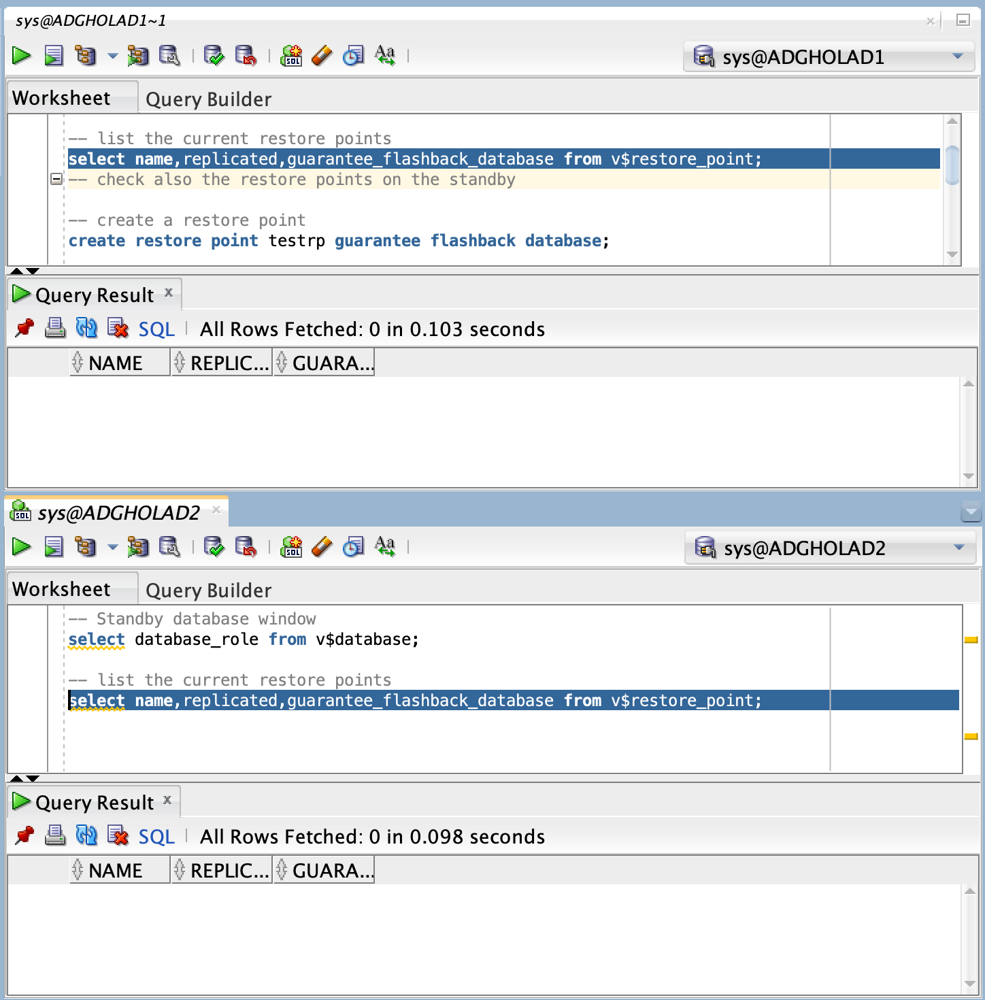
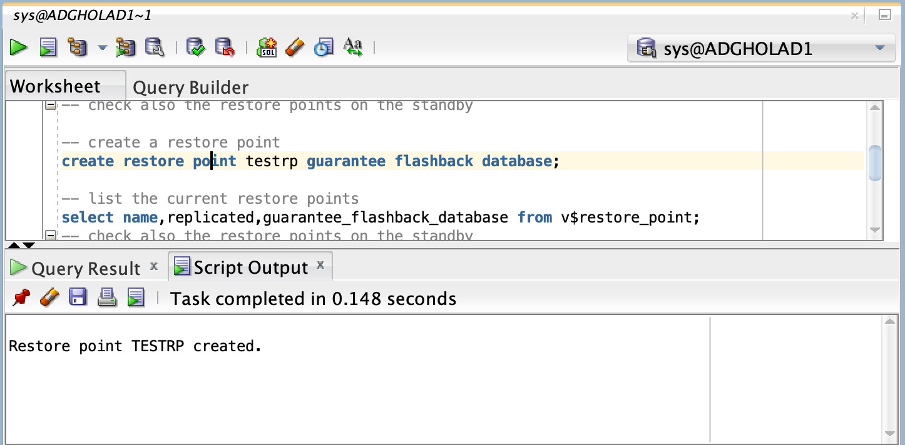

# Restore point propagation

In this lab we will use the 19c new feature which is called the Restore point propagation.


In Oracle Data Guard 19c, when you create a restore point, this restore point is also propagated to the standby database.

This can be particularly useful in situations that during a logical operation on the primary database, the database suddenly fails beyond repair. When you perform a failover, the database would be in the same state as the primary, which would be logically corrupt. 

To avoid this, we are now forwarding the restore points automatically, that in case you need to use the standby, you can also flashback the standby database to a known good point in time.

To accomodate this, the `v$restore_point` view was updated with a `REPLICATED` column and the restore point name is suffixed with `_PRIMARY`.

> **Warning** on copying and pasting commands with multiple lines from the browser screen; when you copy from outside of the Remote Desktop environment and paste inside the Remote Desktop environment, additional **enters** or CRLF characters are pasted causing some commands to fail. 

## Create a restore point in the primary

Download the 2 textfiles with the sql commands.

[For the primary
](./images/primary.txt)

[For the standby
](./images/standby.txt)

As the SYS user connection, first check the restore points with following query

````
select name,replicated,guarantee_flashback_database from v$restore_point;
````

Do the same on the standby database.



Next create a restore point in the primary database


check the restore points with following query

````
select name,replicated,guarantee_flashback_database from v$restore_point;
````

Do the same on the standby database.


The restore point is replicated to the standby and has been suffixed with `_PRIMARY` and the replicated column on the primary indicates this has been performed.

Next drop the restore point in the primary database


check the restore points with following query

````
select name,replicated,guarantee_flashback_database from v$restore_point;
````

Do the same on the standby database.


## Summary
You have now succesfully used Active Data Guard Restore point propagation.