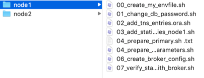
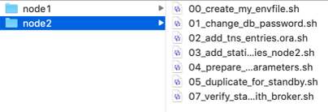

# Setup Data Guard 19c 

In this lab we will setup 19c Data Guard between a primary server and a secondary server. 

This Lab assumes that there are 2 identical servers available. For example the 19c Database Market place image from the OCI. 

It is preferred not to use Database names containing either Primary or Standby, nor any abbreviations. Altough it is just a name, this can become confusing when Role transitions will be performed. You could potentially end up with a primary database which is called "Standby", confusing, isn't it? 

> **Warning** on copying and pasting commands with multiple lines from the browser screen; when you copy from outside of the Remote Desktop environment and paste inside the Remote Desktop environment, additional **enters** or CRLF characters are pasted causing some commands to fail. Solution: Open this lab inside the browser inside the Remote Desktop session.

## Disclaimer ##
The following is intended to outline our general product direction. It is intended for information purposes only, and may not be incorporated into any contract. It is not a commitment to deliver any material, code, or functionality, and should not be relied upon in making purchasing decisions. The development, release, and timing of any features or functionality described for Oracle’s products remains at the sole discretion of Oracle.

## Prerequisites ##

This lab uses multiple scripts to setup Data Guard we will create scripts, per node. When all are executed the environment will be a very basic working Data Guard standby environment. 

As a prerequisite, copy the scripts located in the node1 directory to `/home/oracle` on the first node


And the scripts located in the node2 directory to `/home/oracle` on the second node.


All commands and scripts are executed as the `oracle` user, unless stated otherwise. 

## Create the env-file ##

Using the `00_create_my_envfile.sh` script, create on both nodes an env-file called myenv. 

Script Contents:

````
<copy>
#!/bin/sh
export MY_ENV_FILE=/home/oracle/myenv

read -p "What is the Oracle instance running [ORCL]: " ORACLE_SID
read -p "What is internal IP of the first node: " PRIM
read -p "What is internal IP of the second node: " STBY
read -p "What will be the tns entry for the primary [CLHOLVM1]: " PRIMTNS
read -p "What will be the tns entry for the Standby [CLHOLVM2]: " STBYTNS
read -p "What is Primary DB Unique name [ORCLA]: " PRIMUNQ
read -p "What is Standby DB Unique name [ORCLB]: " STBYUNQ

ORACLE_SID=${ORACLE_SID:-ORCL}
PRIMUNQ=${PRIMUNQ:-ORCLA}
STBYUNQ=${STBYUNQ:-ORCLB}
PRIMTNS=${PRIMTNS:-CLHOLVM1}
STBYTNS=${STBYTNS:-CLHOLVM2}

echo "export ORACLE_SID=${ORACLE_SID}" > ${MY_ENV_FILE} 
echo "export PRIM=${PRIM}" >> ${MY_ENV_FILE} 
echo "export STBY=${STBY}" >> ${MY_ENV_FILE} 
echo "export PRIMUNQ=${PRIMUNQ}" >> ${MY_ENV_FILE} 
echo "export STBYUNQ=${STBYUNQ}" >> ${MY_ENV_FILE}
echo "export PRIMTNS=${PRIMTNS}" >> ${MY_ENV_FILE}
echo "export STBYTNS=${STBYTNS}" >> ${MY_ENV_FILE}
</copy>
````

Check the contents of the myenv file
`# cat /home/oracle/myenv`

## The sys-password ##

The SYS User password is an important password for Data Guard installations. As we do not want to run into too many defaults, it is a good idea to change it now.

Using script `01_change_db_password.sh` this is easily changed.

Script contents:

````
<copy>
#!/bin/sh
. /home/oracle/myenv

read -s -p "New Sys password: " NEWPASS

${ORACLE_HOME}/bin/sqlplus -s '/ as sysdba' << EOF
 alter user sys identified by "${NEWPASS}" container=all;
EOF</copy>
````

For this lab, change it to Welc0me2##
The 0 is a zero.

Make sure to do this on BOTH nodes and make sure to have Exactly (case sensitive) password on both nodes.

## Tns connectivity ##
 
Add `tnsnames.ora` entries on both machines using the `02_add_tns_entries.ora.sh` script

Script Contents:

```
<copy>
#!/bin/sh
. /home/oracle/myenv


echo "${PRIMTNS} = (DESCRIPTION = (ADDRESS = (PROTOCOL = TCP)(HOST = ${PRIM})(PORT = 1521))(CONNECT_DATA = (SERVER = DEDICATED)(SERVICE_NAME = ${PRIMUNQ})(UR=A)))
" >> $ORACLE_HOME/network/admin/tnsnames.ora
echo "${STBYTNS} = (DESCRIPTION = (ADDRESS = (PROTOCOL = TCP)(HOST = ${STBY})(PORT = 1521))(CONNECT_DATA = (SERVER = DEDICATED)(SERVICE_NAME = ${STBYUNQ})(UR=A))) " >> $ORACLE_HOME/network/admin/tnsnames.ora

echo "Displaying tnsnames.ora: "
cat $ORACLE_HOME/network/admin/tnsnames.ora
</copy>
```

## Static registration ##
Later on, we will use the Data Guard broker. In order to use that one correctly, we will add static registration for the DGMRGL services. 

As we will change the DB_UNIQUE _NAME  later one, we will have to do this on both nodes. 
Take into account, that these scripts are slightly different in order to create the correct static entry in the listener.ora.

Add the static entries for the broker on the first node using `03_add_static_listener_entries_node1.sh`

Script contents:

```
<copy>
#!/bin/sh
. /home/oracle/myenv

echo "SID_LIST_LISTENER = (SID_LIST = (SID_DESC = (GLOBAL_DBNAME = ${PRIMUNQ}_DGMGRL)(ORACLE_HOME=/u01/app/oracle/product/19c/dbhome_1)(SID_NAME=ORCL)))" >> $ORACLE_HOME/network/admin/listener.ora

echo "Reloading the listener..."
$ORACLE_HOME/bin/lsnrctl reload

echo "Displaying tnsnames.ora: "
cat $ORACLE_HOME/network/admin/listener.ora
</copy>
```

on the second node, the future standby, we need to add it as follows
with following script `03_add_static_listener_entries_node2.sh`

Script contents:

```
<copy>
#!/bin/sh
. /home/oracle/myenv

echo "SID_LIST_LISTENER = (SID_LIST = (SID_DESC = (GLOBAL_DBNAME = ${STBYUNQ}_DGMGRL)(ORACLE_HOME=/u01/app/oracle/product/19c/dbhome_1)(SID_NAME=ORCL)))" >> $ORACLE_HOME/network/admin/listener.ora

echo "Reloading the listener..."
$ORACLE_HOME/bin/lsnrctl reload

echo "Displaying tnsnames.ora: "
cat $ORACLE_HOME/network/admin/listener.ora
</copy>
```

## Primary database preparation ##

By default an empty database is not ready for Data Guard and we need to set some parameters.

On the first server, our future primary, use script `04_prepare_primary.sh` to set the required parameters

Script Contents:

```
<copy>
#!/bin/sh
. /home/oracle/myenv

mkdir -p /u01/app/oracle/oradata/fra

${ORACLE_HOME}/bin/sqlplus -s "/ as sysdba" << EOF
 alter system set db_recovery_file_dest_size=50G scope=both;
 alter system set db_recovery_file_dest='/u01/app/oracle/oradata/fra' scope=both;
 alter system set log_archive_dest_1='LOCATION=USE_DB_RECOVERY_FILE_DEST VALID_FOR=(ALL_LOGFILES,ALL_ROLES) DB_UNIQUE_NAME=${PRIMUNQ}' scope=both;
 --alter system set DB_NAME=${ORACLE_SID} scope=spfile;
 alter system set DB_UNIQUE_NAME=${PRIMUNQ} scope=spfile;
 alter system set LOG_ARCHIVE_CONFIG='DG_CONFIG=(${PRIMUNQ},${STBYUNQ})' scope=spfile;
 alter system set LOG_ARCHIVE_DEST_2= 'SERVICE=${STBYTNS} ASYNC VALID_FOR=(ONLINE_LOGFILES,PRIMARY_ROLE) DB_UNIQUE_NAME=${STBYUNQ}' scope=spfile;
 alter system set REMOTE_LOGIN_PASSWORDFILE=EXCLUSIVE scope=spfile;
 alter system set FAL_SERVER=${STBYTNS} scope=spfile;
 alter system set STANDBY_FILE_MANAGEMENT=AUTO scope=spfile;
 alter system set DG_BROKER_START=TRUE scope=spfile;
 alter system set archive_lag_target=300 scope=spfile;
 shutdown immediate;
 startup mount;
 alter database archivelog;
 alter database flashback on;
 alter database open;
 alter database add standby logfile size 50m;
 alter database add standby logfile size 50m;
 alter database add standby logfile size 50m;
 select
EOF
</copy>
```

On the second server, which will become the initial standby run the script `04_prepare_standby_db_parameters.sh` to set the required parameters for becoming the standby database

Script Contents:

```
<copy>
#!/bin/sh
. /home/oracle/myenv

mkdir -p /u01/app/oracle/oradata/fra

${ORACLE_HOME}/bin/sqlplus -s "/ as sysdba" << EOF
 alter system set db_recovery_file_dest_size=50G scope=both;
 alter system set db_recovery_file_dest='/u01/app/oracle/oradata/fra' scope=both;
 alter system set log_archive_dest_1='LOCATION=USE_DB_RECOVERY_FILE_DEST VALID_FOR=(ALL_LOGFILES,ALL_ROLES) DB_UNIQUE_NAME=${STBYUNQ}' scope=both;
 --alter system set DB_NAME=${ORACLE_SID} scope=spfile;
 alter system set DB_UNIQUE_NAME=${STBYUNQ} scope=spfile;
 alter system set LOG_ARCHIVE_CONFIG='DG_CONFIG=(${STBYUNQ},${PRIMUNQ})' scope=spfile;
 alter system set LOG_ARCHIVE_DEST_2= 'SERVICE=${PRIMTNS} ASYNC VALID_FOR=(ONLINE_LOGFILES,PRIMARY_ROLE) DB_UNIQUE_NAME=${PRIMUNQ}' scope=spfile;
 alter system set REMOTE_LOGIN_PASSWORDFILE=EXCLUSIVE scope=spfile;
 alter system set FAL_SERVER=${PRIMTNS} scope=spfile;
 alter system set STANDBY_FILE_MANAGEMENT=AUTO scope=spfile;
 alter system set DG_BROKER_START=TRUE scope=spfile;
 alter system set archive_lag_target=300 scope=spfile;
 shutdown immediate;
 startup mount
 alter database archivelog;
 alter database flashback on;
 alter database open;
 alter database add standby logfile size 50m;
 alter database add standby logfile size 50m;
 alter database add standby logfile size 50m;
EOF
</copy>
```

## Duplicate for standby ##
On the standby server duplicate the target (the future primary on node1) database to become a standby on node 2 with the `05_duplicate_for_standby.sh` script.

Script Contents:


```
<copy>
#!/bin/sh
. /home/oracle/myenv


${ORACLE_HOME}/bin/sqlplus -s "/ as sysdba" << EOF
 shutdown abort
 startup nomount
EOF

read -s -p "Sys password: " SYSPASS

${ORACLE_HOME}/bin/rman << EOFF
 set echo on
 connect target sys/${SYSPASS}@${PRIMTNS}
 connect auxiliary sys/${SYSPASS}@${STBYTNS}

 run {
 # create some channels for parallism
 allocate channel ch1 type disk;
 allocate channel ch2 type disk;
 allocate channel ch3 type disk;
 allocate channel ch4 type disk;

 allocate auxiliary channel stby1 type disk;

 duplicate target database for standby from active database
    nofilenamecheck;
 }
EOFF

${ORACLE_HOME}/bin/sqlplus -s "/ as sysdba" << EOFFF
 alter database recover managed standby database disconnect nodelay;
 alter system set log_archive_dest_2='' scope=both;
EOFFF
</copy>
```

## Create the broker configuration ##
Then when all completes, enable the broker to start managed recovery on the standby database with the `06_create_broker_config.sh` script executed on the primary server, the first node. 

Script Contents:


```
<copy>
#!/bin/sh
. /home/oracle/myenv


${ORACLE_HOME}/bin/dgmgrl << EOF
 connect / ;
 create configuration HOLDG as primary database is ${PRIMUNQ} connect identifier is ${PRIMTNS};
 add database ${STBYUNQ} as connect identifier is ${STBYTNS} maintained as physical;
 enable configuration;
 edit database ${PRIMUNQ} set property TransportLagThreshold = 600;
 edit database ${STBYUNQ} set property TransportLagThreshold = 600;
 edit database ${PRIMUNQ} set property ApplyLagThreshold = 600;
 edit database ${STBYUNQ} set property ApplyLagThreshold = 600;
 edit database ${PRIMUNQ} set property TransportDisconnectedThreshold = 600;
 edit database ${STBYUNQ} set property TransportDisconnectedThreshold = 600;
EOF

${ORACLE_HOME}/bin/sqlplus -s "/ as sysdba" << EOFF
 alter system archive log current;
EOFF
</copy>
```

> **Remark** The edit database commands at the end to set the properties, are meant for demo purposes. You might want to tune this for your environment.

## Verify the installation ##

Give the installation a minute to finish up things and then on the primary with script `07_verify_status_with_broker.sh` verify the Data Guard status

Script Contents:


```
<copy>
#!/bin/sh
. /home/oracle/myenv


${ORACLE_HOME}/bin/dgmgrl << EOF
 connect / ;
 show configuration lag verbose;
EOF
</copy>
```

## Conclusion  
Congratulations! This concludes the first step, setting up a basic Data Guard physical standby database. 