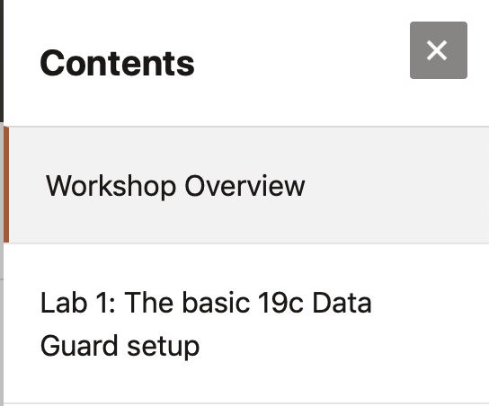

# (Active) Data Guard 19c Hands-On-Lab (HOL) #

## Workshop Overview ##

**19c Database** is the current version that Oracle promotes to customers and partners as the version to upgrade to. Oracle 19c is the long term support version and will be supported for at least 4 years after the initial release. After this, Extended support and Sustaining support will be available.

This hands-on workshop focuses on **Creating Data Guard and Active Data Guard for your environment in 19c**.

## Workshop Requirements

- Access to 
	- Oracle Cloud Infrastructure 
    	- Provided by the instructor for instructor-led workshops
    	- A HOL version is being created to run stand-alone without instructor
	- A virtualbox environment 
- Access to a laptop or a desktop
    - Requires Microsoft Remote Desktop software

## Agenda

- **Lab 001 :** Create a very basic 19c Data Guard setup

We need 2 machines, either in the cloud or on premises to run this Lab. Those machines need to have an 19c Enterprise Edition Oracle Home with a default listener configured. On the first Machine a CDB needs to be created.

## Access the labs

- Use **Lab Contents** menu on your right to access the labs.
    - If the menu is not displayed, click the menu button  on the top right  make it visible.

- From the menu, click on the lab that you like to proceed with. For example, if you like to proceed to **Lab 1**, click **Lab 1: The basic 19c Data Guard Setup**. This lab needs to be completed before the other labs can be run correctly.

- You may close the menu by clicking 

## Acknowledgements ##

- **Author** - Pieter Van Puymbroeck, Product Manager Data Guard, Active Data Guard and Flashback Technologies
- **Special thanks to** - Robert Pastijn, Database Product Management, PTS EMEA - April 2020